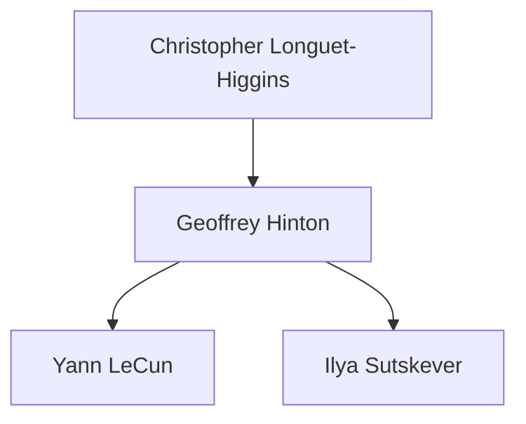

# NEXEN 技能参考手册

> 本文档详细描述所有可用技能的使用方法和参数

---

## 技能索引

- [文献研究类](#文献研究类)
- [人物谱系类](#人物谱系类)
- [技术历史类](#技术历史类)
- [实验分析类](#实验分析类)
- [写作输出类](#写作输出类)
- [思维辅助类](#思维辅助类)
- [信息检索类](#信息检索类)
- [系统管理类](#系统管理类)

---

## 文献研究类

### `/survey` - 快速领域综述

**描述**: 对指定主题生成结构化文献综述

**语法**:
```
/survey {topic}
```

**示例**:
```
/survey Mamba架构在视觉任务中的应用
/survey "Large Language Model Reasoning"
```

**涉及Agent**: Explorer → CN_Specialist → Connector → Genealogist → Critic → Scribe

**工作流程**:
1. Explorer: 检索arXiv/Semantic Scholar (近2年, top引用)
2. CN_Specialist: 并行检索知网/知乎讨论
3. Connector: 识别相关领域论文
4. Genealogist: 识别关键研究者和学派
5. Critic: 筛选高质量论文 (>10引用或顶会)
6. Scribe: 生成综述报告

**输出**:
- `digest/surveys/{topic}_survey.md`
- 包含: 背景、关键方法、对比表、研究空白、参考文献

---

### `/paper-deep-dive` - 论文深度解读

**描述**: 对单篇论文进行全方位深度分析

**语法**:
```
/paper-deep-dive {arxiv_id|paper_title|url}
```

**示例**:
```
/paper-deep-dive 2312.00752
/paper-deep-dive "Attention Is All You Need"
```

**涉及Agent**: Explorer → Vision_Analyst → Logician → Genealogist → Critic → Scribe

**输出**:
```
knowledge_base/papers/{paper_id}/
├── summary.md          # 一句话总结 + 关键贡献
├── method_analysis.md  # 方法细节
├── figures_explained.md # 图表解读
├── limitations.md      # 局限性分析
├── code_review.md      # 代码质量 (如有)
└── my_notes.md         # 研究灵感
```

---

### `/trend` - 研究趋势分析

**描述**: 分析特定领域的研究趋势和热点

**语法**:
```
/trend {field} [--period 6m|1y|2y]
```

**示例**:
```
/trend "LLM推理优化" --period 1y
/trend "Multimodal Learning"
```

**参数**:
- `--period`: 分析时间范围，默认1年

**输出**:
- 发表量时间曲线
- 关键里程碑论文
- 技术路线演进图
- 关键人物和学派动态
- 预测下一个热点方向

---

### `/related-work` - 相关工作梳理

**描述**: 为你的研究想法找到相关工作并生成Related Work段落

**语法**:
```
/related-work {your_idea_description}
```

**示例**:
```
/related-work "用强化学习优化Mamba的状态选择机制"
```

**输出**:
- 相关论文列表 (按相关度排序)
- 可直接用于论文的Related Work段落
- 差异化分析 (你的想法 vs 已有工作)

---

### `/citation-tree` - 引用关系图谱

**描述**: 构建论文引用关系网络，找到关键节点

**语法**:
```
/citation-tree {paper_id} [--depth 2]
```

**参数**:
- `--depth`: 追溯深度，默认2层

**输出**:
- 引用关系可视化图
- 关键被引论文 (高影响力节点)
- 最新引用论文 (follow-up工作)

---

## 人物谱系类

### `/who` - 人物档案查询

**描述**: 构建关键人物的全方位档案

**语法**:
```
/who {person_name}
```

**示例**:
```
/who "Ilya Sutskever"
/who 杨立昆
```

**涉及Agent**: Genealogist (主导) + Social_Scout + Explorer

**数据来源**:
- Google Scholar: 论文、引用、合作者
- LinkedIn: 职业经历
- Wikipedia: 传记信息
- Twitter/X: 近期观点
- Crunchbase: 商业活动

**输出**:
```
knowledge_base/people/{person_id}/
├── profile.yaml    # 结构化档案
├── summary.md      # 人类可读摘要
├── timeline.md     # 生涯时间线
└── publications.json
```

---

### `/lineage` - 学术谱系追溯

**描述**: 追溯人物的学术师承关系

**语法**:
```
/lineage {person_name} [--depth 3] [--direction up|down|both]
```

**参数**:
- `--depth`: 追溯代数，默认3代
- `--direction`: 方向
  - `up`: 向上追溯导师
  - `down`: 向下追溯学生
  - `both`: 双向追溯

**示例**:
```
/lineage "Yoshua Bengio" --depth 3 --direction both
```

**输出**:


---

### `/thought-evolution` - 思想演进追踪

**描述**: 追踪人物思想观点的演进历程

**语法**:
```
/thought-evolution {person_name} [--topic {specific_topic}]
```

**示例**:
```
/thought-evolution "Geoffrey Hinton" --topic "AI safety"
```

**输出**:
- 观点演进时间线
- 关键转折点分析
- 思想影响来源

---

### `/school` - 学派分析

**描述**: 分析特定学派的成员、观点和影响力

**语法**:
```
/school {school_name|founder_name}
```

**示例**:
```
/school "Toronto Deep Learning"
/school "Geoffrey Hinton"
```

**输出**:
- 学派定义与核心理念
- 创始人与核心成员
- 代表性成果
- 与其他学派的关系

---

### `/network` - 社交网络分析

**描述**: 分析人物的学术/职业社交网络

**语法**:
```
/network {person_name} [--type academic|industry|all]
```

**输出**:
- 网络可视化图
- 关键连接人物
- 中心度分析
- 社区聚类

---

### `/influence-map` - 思想影响图谱

**描述**: 绘制思想/技术的影响传播图谱

**语法**:
```
/influence-map {idea|paper|person}
```

**示例**:
```
/influence-map "Attention is All You Need"
```

---

### `/rivalry` - 学术争论分析

**描述**: 分析学术领域的重要争论和观点对立

**语法**:
```
/rivalry {topic|person1 vs person2}
```

**示例**:
```
/rivalry "scaling laws debate"
/rivalry "Gary Marcus vs Yann LeCun"
```

---

### `/extract-people` - 从论文提取关键人物

**描述**: 从论文/文章中提取关键人物并建立档案

**语法**:
```
/extract-people {paper_id|url|file}
```

---

## 技术历史类

### `/tech-origin` - 技术起源追溯

**描述**: 追溯一项技术的起源和早期发展

**语法**:
```
/tech-origin {technology_name}
```

**示例**:
```
/tech-origin "Batch Normalization"
/tech-origin "Transformer"
```

**输出**:
- 起源论文详情
- 问题背景分析
- 前置技术谱系
- 早期演化路径

---

### `/timeline` - 技术时间线

**描述**: 构建某项技术的完整发展时间线

**语法**:
```
/timeline {technology_name} [--from year] [--to year]
```

**示例**:
```
/timeline "Transformer" --from 2017 --to 2024
```

**输出**:
```
2017 ●━━━ Transformer发布 [Paradigm Shift] ★★★★★
     │    "Attention Is All You Need"
     │
2018 ●━━━ BERT [Application] ★★★★★
     │    预训练语言模型
...
```

---

### `/evolution` - 技术演进图谱

**描述**: 绘制技术的完整演进图谱，包括分叉和融合

**语法**:
```
/evolution {technology_name} [--depth detailed|overview]
```

**示例**:
```
/evolution "Language Models" --depth detailed
```

---

### `/branch-analysis` - 分叉点深度分析

**描述**: 深入分析技术发展中的某个关键分叉点

**语法**:
```
/branch-analysis {technology} --branch {branch_description}
```

**示例**:
```
/branch-analysis "Attention" --branch "Efficient Attention"
```

---

### `/axis` - 演进轴分析

**描述**: 分析技术沿某个维度的演进历程

**语法**:
```
/axis {technology} --dimension {dimension}
```

**常用维度**:
- `scale`: 规模 (参数量、数据量)
- `efficiency`: 效率 (速度、内存)
- `capability`: 能力 (准确率、泛化)
- `simplicity`: 简化 (架构、训练)
- `generality`: 通用性 (任务、模态)

**示例**:
```
/axis "Neural Networks" --dimension "depth"
/axis "LLM" --dimension "parameter scale"
```

---

### `/tech-compare` - 技术路线对比

**描述**: 对比分析多条技术路线的发展历程

**语法**:
```
/tech-compare {tech1} vs {tech2} [vs {tech3}]
```

**示例**:
```
/tech-compare "Transformer" vs "SSM" vs "RNN"
```

---

### `/predict-next` - 技术趋势预测

**描述**: 基于历史演进模式预测技术未来发展

**语法**:
```
/predict-next {technology}
```

**输出**:
- 短期预测 (1年)
- 中期预测 (2-3年)
- 可能的突破点
- 风险与不确定性

---

## 实验分析类

### `/replicate` - 论文复现助手

**语法**: `/replicate {paper_id|github_url}`

### `/ablation` - 消融实验设计

**语法**: `/ablation {method_description}`

### `/benchmark` - 基准测试对比

**语法**: `/benchmark {method} --dataset {dataset} --baselines {methods}`

### `/debug-exp` - 实验调试助手

**语法**: `/debug-exp {问题描述}`

---

## 写作输出类

### `/draft` - 论文草稿生成

**语法**: `/draft {section} [--style acl|neurips|iclr]`

**可用section**: abstract, introduction, related-work, method, experiments, conclusion

### `/rebuttal` - Rebuttal生成

**语法**: `/rebuttal {reviews_file}`

### `/slides` - 演示文稿生成

**语法**: `/slides {research_session} [--style academic|industry|5min]`

### `/blog` - 技术博客生成

**语法**: `/blog {paper_id|session_id} [--audience beginner|expert]`

---

## 思维辅助类

### `/brainstorm` - 研究头脑风暴

**语法**: `/brainstorm {research_question}`

### `/critique` - 方法批判分析

**语法**: `/critique {paper_id|method_description}`

### `/compare` - 方法对比分析

**语法**: `/compare {method1} vs {method2} [vs {method3}]`

### `/hypothesis` - 假设生成与验证

**语法**: `/hypothesis {observation}`

### `/refine-idea` - 想法精炼

**语法**: `/refine-idea {initial_idea}`

---

## 信息检索类

### `/arxiv-watch` - arXiv监控

**语法**: `/arxiv-watch {keywords} [--daily|--weekly]`

### `/social-pulse` - 社交媒体脉搏

**语法**: `/social-pulse {topic}`

### `/code-search` - 代码搜索

**语法**: `/code-search {method_name|paper_title}`

### `/dataset-find` - 数据集发现

**语法**: `/dataset-find {task_description}`

---

## 系统管理类

### `/recall` - 记忆检索

**语法**: `/recall {query}`

### `/digest` - 手动触发摘要

**语法**: `/digest [--full|--incremental]`

### `/export` - 导出研究成果

**语法**: `/export {session_id} [--format md|pdf|html|notion]`

### `/checkpoint` - 创建检查点

**语法**: `/checkpoint {name}`

---

*NEXEN Skills Reference Manual*
